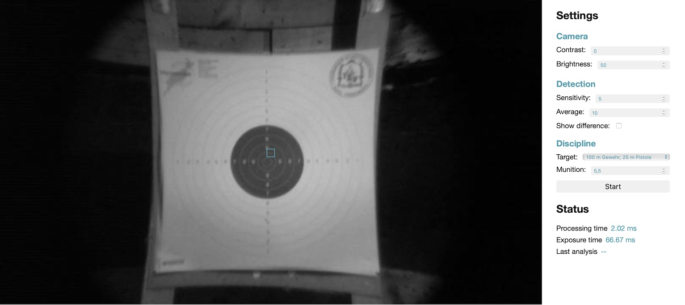
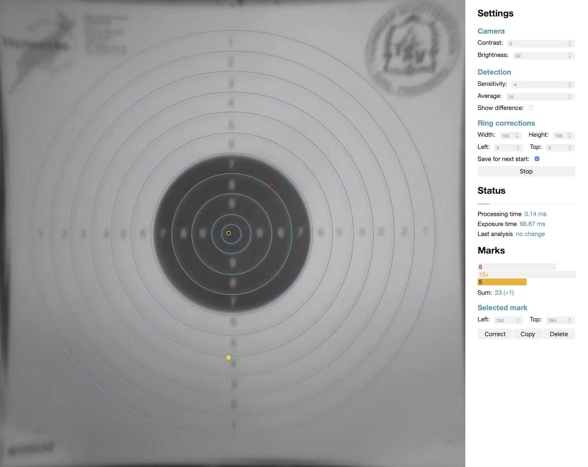

# Spotter
Marking small changes on a static target using the Raspberry Pi camera

## Getting started
- Make sure you have the following Python packages installed:
    - [numpy](https://pypi.org/project/numpy/)
    - [scipy](https://pypi.org/project/scipy/)
    - [Pillow](https://pypi.org/project/Pillow/)
    - (should be already installed on a Raspberry Pi: [picamera](https://picamera.readthedocs.io))
- In the project directory, run `python3 server.py`. This startes a web-based GUI on a local webserver, which can be accessed with the browser. 

### Preview state
On start-up, the application is in a preview state, where the camera has to be aligned until the small rect is inside the mirror.

TODO: Explain settings

### Detection state
After clicking start and a short waiting phase, hits on the target should be detected and marked.

Marks can be selected to delete them, duplicate them, or correct their position.

## Emulation
### With artificially generated frames
When running with `python3 server.py -e`, the emulation mode is activated, i.e. no picamera package is needed and the camera frames are artificially generated.

### With frames from a video
Instead of a using live data from the pi camera, frames from a video can be feed into the system with `python3 server.py -e -v path/to/videofile.suffix`. **Note:** This requires the *opencv-python* Python package to be installed.