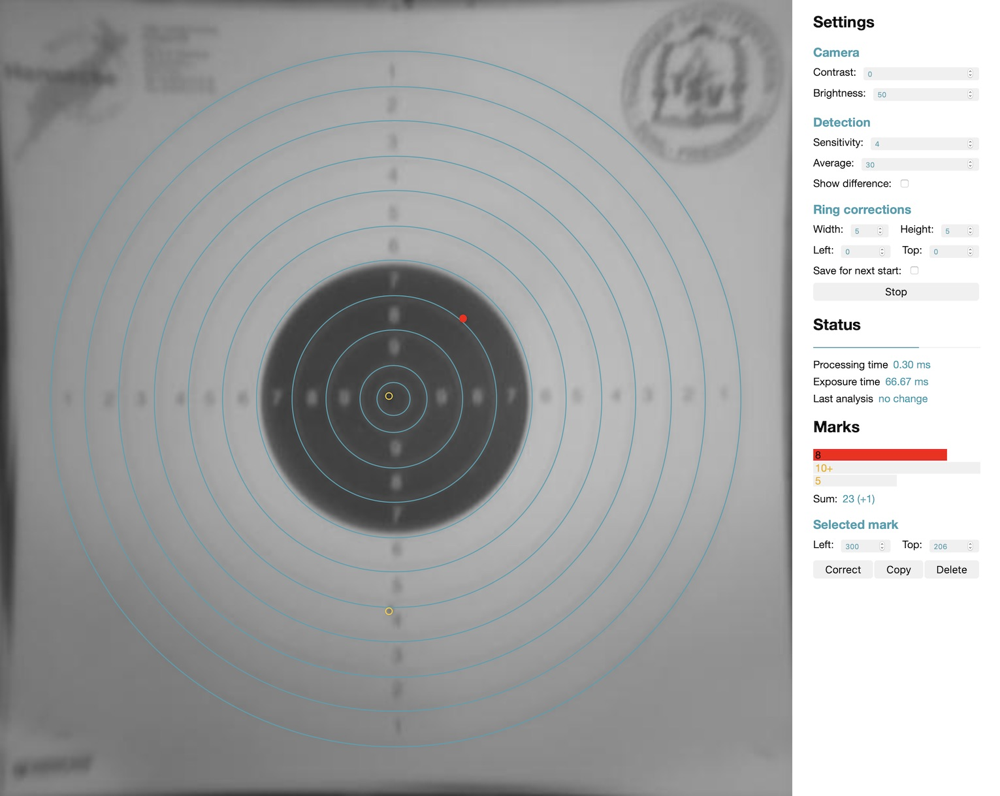

# Spotter
Marking small changes on a static target using the Raspberry Pi camera

## Getting started
Assuming you are logged in on a Raspberry Pi with internet connection and have cloned this project
- Enable the camera with `sudo raspi-config` -> select *Interfacing Options* -> select *Camera* and enable it, then reboot
- Make sure you have the following packages for Python3 installed:
    - [numpy](https://pypi.org/project/numpy/)
    - [scipy](https://pypi.org/project/scipy/)
    - [Pillow](https://pypi.org/project/Pillow/)
    - [picamera](https://picamera.readthedocs.io) (may be already installed)
- In the project directory, run `python3 server.py`. This startes a web-based GUI on a local webserver, which can be accessed with the browser. 

### Preview state
On start-up, the application is in a preview state, where the camera has to be aligned until the small rect is inside the mirror.

#### Settings
- Camera
    - The **Contrast** and **Brightness** values can be used to optimize the detection: The paper should be as bright as possible without being over-exposured. The mirror should be dark-gray, but not black.
- Detection
    - **Sensitivity**: With lower values, the chance of detecting holes are higher, but when set too low, small changes are detected too which are not holes. Basically, this value should be set as high as possible while still detecting holes.
    - **Average**: The number of camera images to combine to an averaged image before analyzing. Higher values reduce noise and small movements, which is good for the detection, but the analysis time is also increased.
    - **Show difference**: The amplified difference between consecutive, averaged images is shown instead of the averaged image.
- Discipline:
    - **Target**: Defines the rings. Must be set like the actual target.
    - **Munition**: Diameter in mm of the holes on the target.

### Detection state
After clicking start and a short waiting phase, hits on the target should be detected and marked.

Marks can be selected to delete them, duplicate them, or correct their position.

#### Settings
- Ring corrections
    - The **Width** and **Height** values can be used to change the size of the rings.
    - The **Left** and **Top** values can be used to change the position of the rings.

## Emulation
### With artificially generated frames
When running with `python3 server.py -e`, the emulation mode is activated, i.e. no picamera package is needed and the camera frames are artificially generated.

### With frames from a video
Instead of a using live data from the pi camera, frames from a video can be feed into the system with `python3 server.py -e -v path/to/videofile.suffix`. **Note:** This requires the *opencv-python* Python package to be installed.